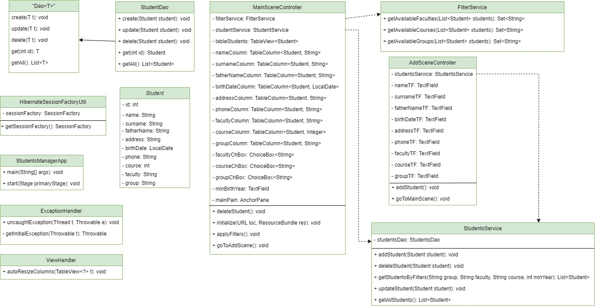
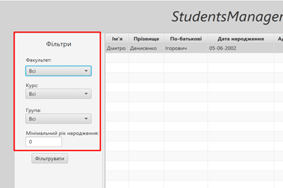
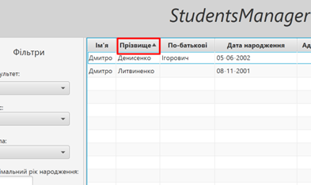
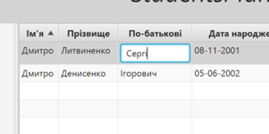
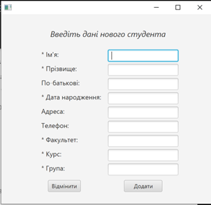
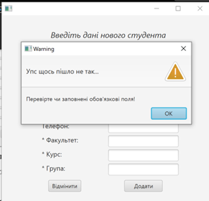

# StudentsManager
Desktop application for managing student records in DB. Implemented CRUD operations, filtering, sorting.

## Technologies
Java 8, JavaFX, Hibernate, Oracle RDBMS

## Class diagram

## Use cases instruction

1.	Main menu
*	students filtering
Pick needed parameters and click “Фільтрувати”

Records were filtered, provided appropriate
*	Sorting by table columns

Click to some column header, 1 time - order by ascending, 2 - order by descending
*	Edit records
Select student parameter using doubleclick, fill input with new value, press Enter.

*	Deleting record
Pick student
Click “Видалити студента” button.
*	Creating new student record
Click “Додати студента” button. Moving to creation view.
3.	Creation menu

Fill at least required fields abd press “Додати”. Also there is ability to cancel operation using “Відмінити” button.

4.	In case of warning arising, follow the recommendations and try again

